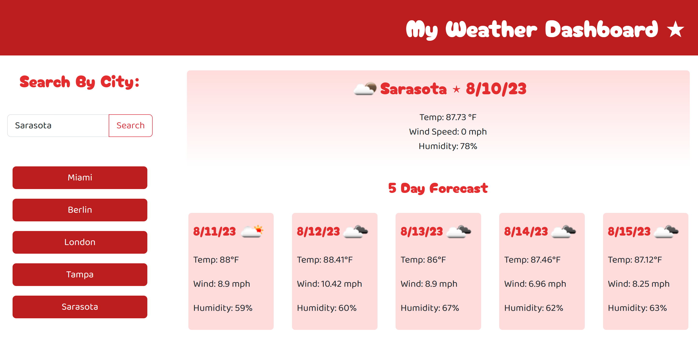

# My Weather Dashboard

## Description

A clean, cute and simple weather app designed to fetch the present and 5-day forecast of a searched city! This app was built to gain more experience with using third-party APIs as well as further explore the possible uses of local storage.

## Installation
N/A 

## Usage 

Click <a href="https://abbyjo.github.io/the-weather-up-there/">this link</a> in your favorite browser to open the dashboard! 
On the left hand side of the page you can input a city name of your choosing. Upon submission your search will be saved on the left as a button and the current forecast as well as the forecast for the next five days will appear in the main body of the page! If you would like to rerun a prior search, simply click on the buttons below the search bar to run your search again~    
 
  

## Credits 

<a href="https://stackoverflow.com/questions/44177417/how-to-display-openweathermap-weather-icon">This post on Stack Overflow</a> helped me figure out how to add weather icons to each section! 
<a href="https://stackoverflow.com/questions/70998906/how-do-i-access-each-item-of-an-array-stored-in-local-storage-individually">This post on Stack Overflow</a> helped me figure out how to save user input into local storage as an array! 
<a href="https://youtu.be/2hJ1rTANVnk">This video</a> was also helpful in helping me figure out how to utilize local storage!

## License
MIT License
